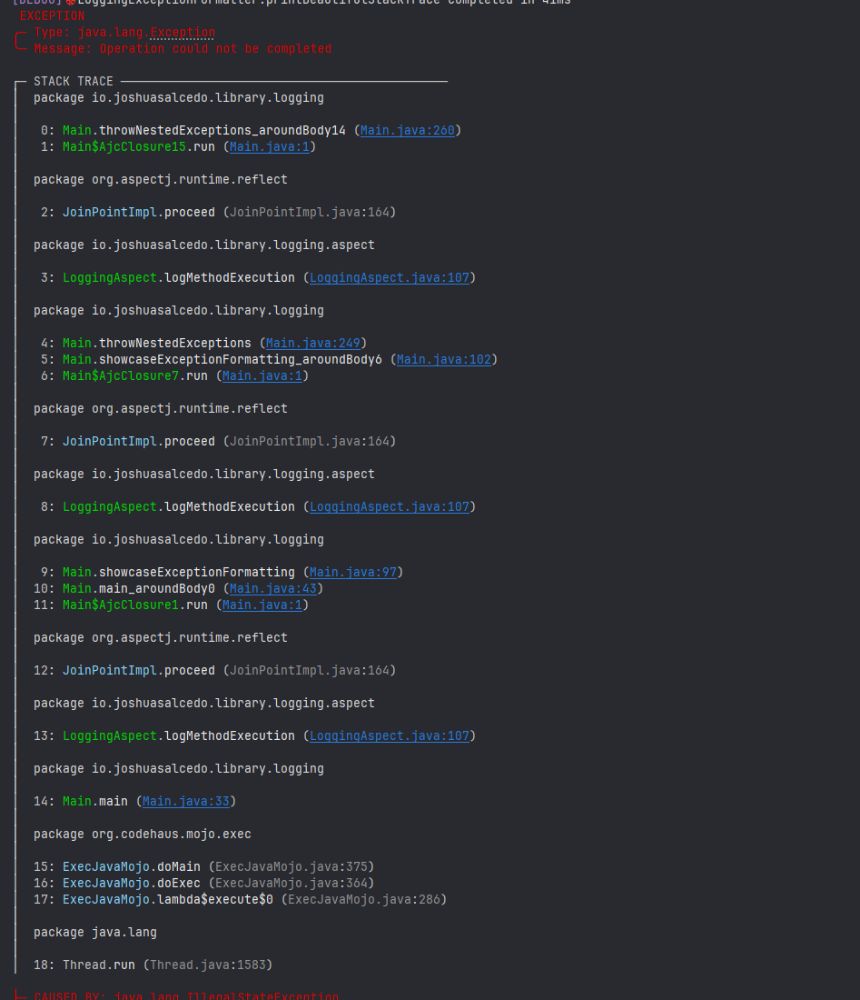
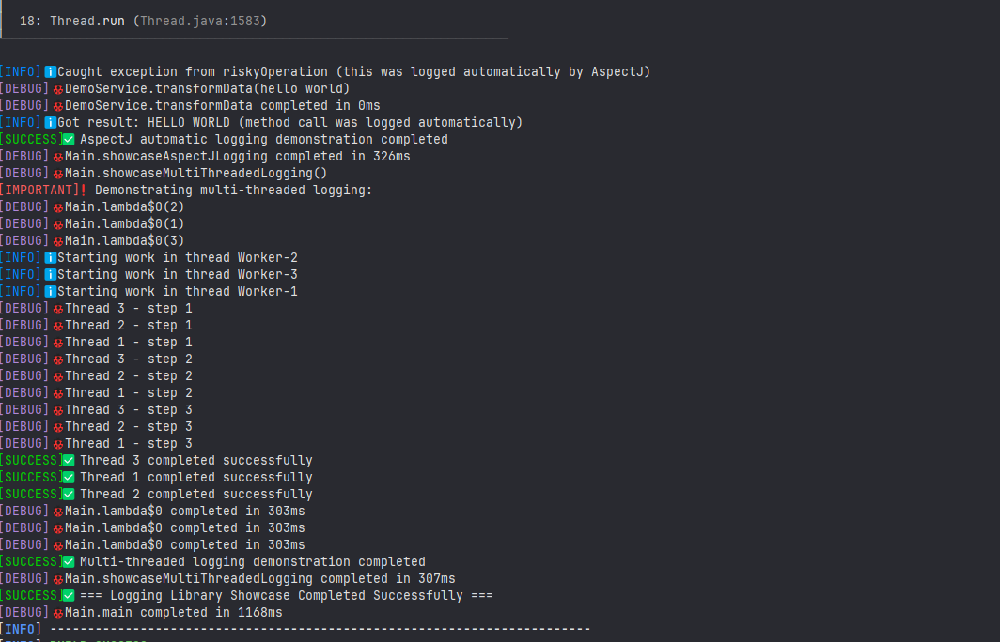

# AspectJ Logging Library

A comprehensive AspectJ-powered logging library that automatically logs method execution with beautiful exception formatting and context tracking.

## Features

- **Automatic Method Logging**: Log method entry/exit, execution time, and parameters without code changes
- **Beautiful Exception Formatting**: Colorized stack traces with syntax highlighting and improved readability
- **Exception Context Tracking**: Enhances exceptions with runtime context information
- **Eleven Log Levels**: From TRACE to FATAL with proper color coding and emoji support
- **Context-Aware Exceptions**: Custom exception types with solutions and troubleshooting tips
- **Specialized Exception Types**: Database, Validation, and Configuration exceptions with context
- **Flexible Integration**: Works via compile-time weaving or load-time weaving

## Getting Started

### Step 1: Add the dependency

```xml
<dependency>
    <groupId>io.joshuasalcedo.library</groupId>
    <artifactId>aop-logging</artifactId>
    <version>1.0.0</version>
</dependency>
```

### Step 2: Enable AspectJ Weaving

Choose one of these options:

#### Option A: Compile-time weaving (recommended)

Add to your `pom.xml`:

```xml
<build>
    <plugins>
        <plugin>
            <groupId>org.codehaus.mojo</groupId>
            <artifactId>aspectj-maven-plugin</artifactId>
            <version>1.14.0</version>
            <configuration>
                <complianceLevel>21</complianceLevel> <!-- Match your Java version -->
                <source>21</source>
                <target>21</target>
                <aspectLibraries>
                    <aspectLibrary>
                        <groupId>io.joshuasalcedo.library</groupId>
                        <artifactId>aop-logging</artifactId>
                    </aspectLibrary>
                </aspectLibraries>
            </configuration>
            <executions>
                <execution>
                    <goals>
                        <goal>compile</goal>
                    </goals>
                </execution>
            </executions>
        </plugin>
    </plugins>
</build>
```

#### Option B: Load-time weaving

Run your application with the AspectJ agent:

```bash
java -javaagent:/path/to/aspectjweaver.jar -jar your-application.jar
```

Or with Maven:

```bash
mvn exec:java -Dexec.mainClass="com.example.YourMainClass" \
    -Dexec.args="-javaagent:${settings.localRepository}/org/aspectj/aspectjweaver/1.9.24/aspectjweaver-1.9.24.jar"
```

### Step 3: Configure (optional)

```java
// Configure global settings
Logging.setGlobalThreshold(LogLevel.DEBUG);
Logging.setEnhancedFormatting(true); // Use emoji formatting

// Set package-specific log levels
Logging.setPackageLogLevel("com.example.service", LogLevel.TRACE);
Logging.enableDebug("com.example.controller");
```

## Basic Usage

Once configured, method logging happens automatically. For explicit logging:

```java
import io.joshuasalcedo.library.logging.core.Logger;
import io.joshuasalcedo.library.logging.core.Logging;

public class MyService {
    private static final Logger logger = Logging.getLogger(MyService.class);
    
    public void processData(String data) {
        logger.info("Processing data...");
        
        try {
            // Your business logic
            logger.success("Data processed successfully");
        } catch (Exception e) {
            logger.error("Failed to process data", e);
            throw e;
        }
    }
}
```

## Enhanced Exception Handling

The library provides rich exception formatting and context tracking:

```java
import io.joshuasalcedo.library.logging.exception.ExceptionFactory;
import io.joshuasalcedo.library.logging.exception.LoggingExceptionFormatter;

try {
    // Your code
} catch (Exception e) {
    // Option 1: Format any exception
    LoggingExceptionFormatter formatter = new LoggingExceptionFormatter();
    System.out.println(formatter.format(e));
    
    // Option 2: Create context-aware exceptions
    throw ExceptionFactory.error("Failed to process request", e)
        .withContext("userId", userId)
        .withContext("requestId", requestId)
        .withSolution("Check if the user exists and has proper permissions");
}
```

## Specialized Exception Types

Create domain-specific exceptions with built-in context:

```java
// Database exceptions
throw ExceptionFactory.dbError("Failed to insert record", sqlException)
    .withDatabase("customers_db")
    .withQuery("INSERT INTO customers VALUES (?, ?, ?)")
    .withParameters(id, name, email);
    
// Validation exceptions
throw ExceptionFactory.validationError("Invalid email format")
    .withField("email")
    .withValue(email)
    .withConstraint("pattern", "^[A-Za-z0-9+_.-]+@(.+)$");
    
// Configuration exceptions
throw ExceptionFactory.configError("Missing required configuration")
    .withProperty("database.url")
    .withSource("application.properties");
```

## Log Levels

The library supports these log levels (in ascending order of severity):

- `TRACE`: Detailed tracing information (🔍)
- `DEBUG`: Debugging information (🐞)
- `INFO`: General information (ℹ️)
- `SUCCESS`: Operation completed successfully (✅)
- `NOTICE`: Notable event (📢)
- `IMPORTANT`: Significant event requiring attention (❗)
- `WARN`: Warning that might cause issues (⚠️)
- `ERROR`: Error that affects operation (❌)
- `SEVERE`: Serious error that may cause system instability (🚨)
- `FATAL`: Critical error that will cause system failure (💀)
- `STUB`: Code under development (🚧)

## Customizing the Formatter

Create a custom-styled exception formatter:

```java
LoggingExceptionFormatter formatter = LoggingExceptionFormatter.builder()
    .logLevel(LogLevel.ERROR)
    .highlightPackage("com.mycompany", TerminalStyle.SUCCESS)
    .style("header", TerminalStyle.UI_HEADER)
    .style("message", TerminalStyle.EMPHASIS)
    .style("stackTrace", TerminalStyle.SECONDARY)
    .build();
```

## Custom aop.xml

Create `META-INF/aop.xml` in your project to customize weaving:

```xml
<aspectj>
    <weaver options="-showWeaveInfo">
        <!-- Include your packages -->
        <include within="com.mycompany..*"/>
        
        <!-- Exclude packages you don't want logged -->
        <exclude within="com.mycompany.config.*"/>
    </weaver>
</aspectj>
```

## Comprehensive Example

```java
public class Demo {
    private static final Logger logger = Logging.getLogger(Demo.class);
    
    public static void main(String[] args) {
        // Configure logging
        Logging.setGlobalThreshold(LogLevel.TRACE);
        Logging.setPackageLogLevel("com.example", LogLevel.DEBUG);
        
        try {
            logger.info("Starting application...");
            
            // Methods are logged automatically by AspectJ
            UserService service = new UserService();
            User user = service.getUser("user123"); // Logged automatically
            
            logger.success("Application started successfully");
            
        } catch (Exception e) {
            // Enhanced exception reporting
            logger.severe("Application failed to start", e);
            
            // Print detailed report
            LoggingExceptionFormatter formatter = new LoggingExceptionFormatter();
            formatter.printExceptionReport(e, System.out, createContext());
        }
    }
    
    private static Map<String, Object> createContext() {
        Map<String, Object> context = new HashMap<>();
        context.put("Application", "Demo");
        context.put("Version", "1.0.0");
        return context;
    }
}
```

## Demo Screenshots

### Beautiful Exception Formatting



### Automatic Method Logging and Multi-threading Support



## Troubleshooting

If aspects aren't being applied:

1. Verify your AspectJ Maven plugin configuration
2. Ensure the AspectJ weaver agent is correctly configured for load-time weaving
3. Run with `-Dorg.aspectj.weaver.showWeaveInfo=true` to see weaving details
4. Check that your packages are included in the weaving patterns

## License

This library is licensed under the MIT License - see the LICENSE file for details.

## Credits

Developed by Joshua Salcedo - https://github.com/joshuasalcedo-dev

This library builds on:
- AspectJ for aspect-oriented programming
- Pretty Java Core for terminal styling and formatting